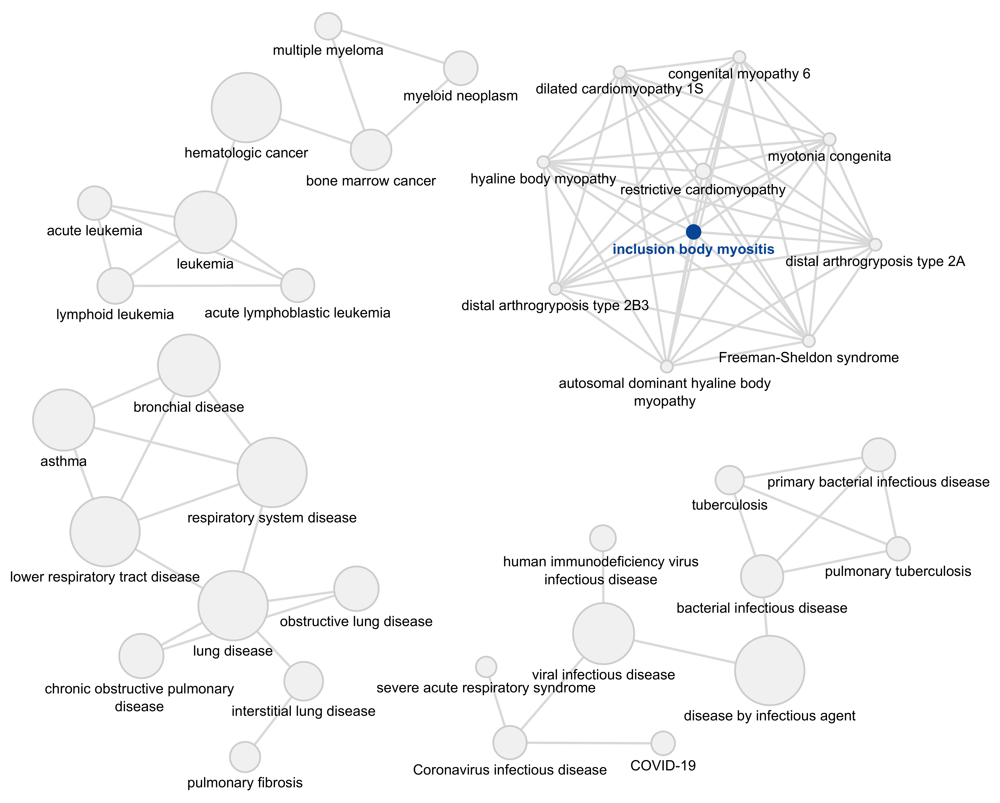
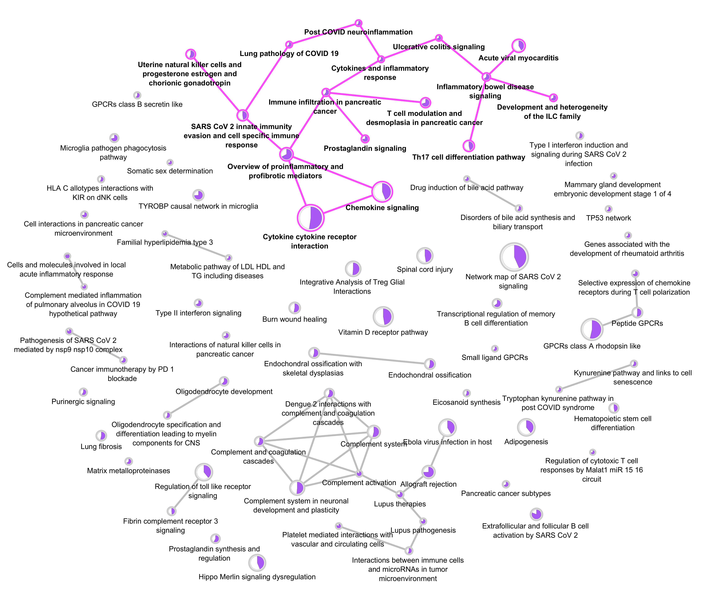
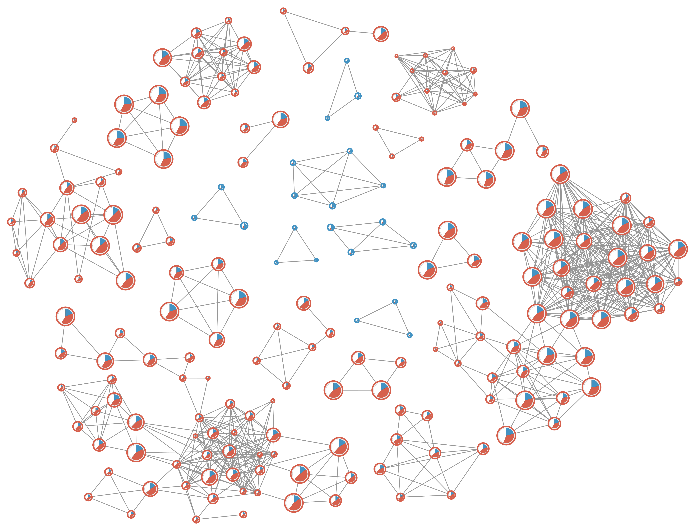
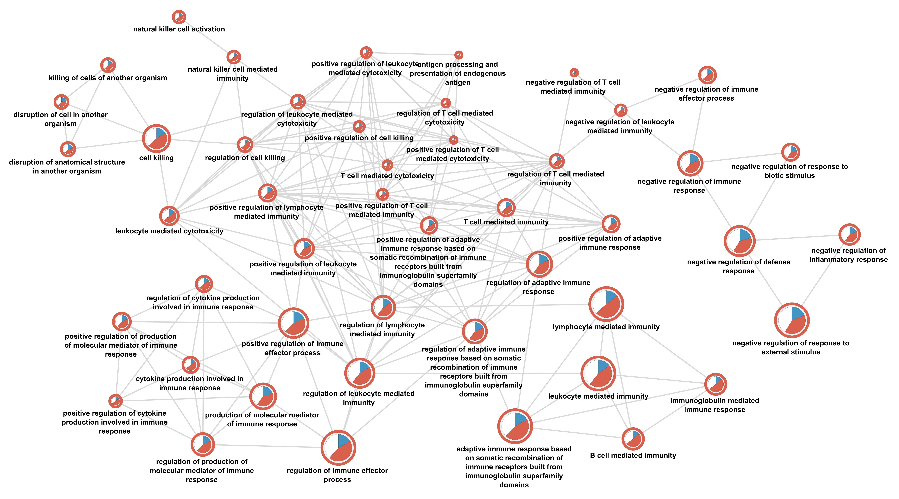

# cyemapplot: Advanced Network Visualization for Enrichment Analysis

## Overview

`cyemapplot` is an R function that extends the capabilities of the [clusterProfiler](https://bioconductor.org/packages/clusterProfiler/) package by exporting functional enrichment analysis results to [Cytoscape](https://cytoscape.org/) for advanced network visualization and customization. Built upon the `emapplot` function from the [enrichplot](https://bioconductor.org/packages/enrichplot/) package, `cyemapplot` enables researchers to create publication-quality network visualizations that reveal relationships between enriched terms through shared gene content.

## Key Features

- **Three Visualization Styles:**
  - **Basic**: Standard network showing enriched terms and similarity relationships
  - **Pie**: Nodes display proportion of input genes within each enriched term
  - **DEG**: Enhanced visualization with gene expression directionality and regulation patterns

- **Cytoscape Integration:** Leverages Cytoscape's powerful layout algorithms, styling options, and network analysis tools

- **Flexible Network Filtering:** Filter networks by cluster size and visualize top components separately

- **Compatible with ORA and GSEA:** Works with both over-representation analysis and gene set enrichment analysis results

- **Multiple Databases Supported:** Disease Ontology, WikiPathways, Gene Ontology, KEGG, Reactome, and custom gene sets

### Prerequisites

1. **R** (version 4.5.1 or higher): [Download R](https://www.r-project.org/)
2. **RStudio** (recommended): [Download RStudio](https://posit.co/download/rstudio-desktop/)
3. **Cytoscape** (version 3.10.0 or higher): [Download Cytoscape](https://cytoscape.org/)

### Install Required R Packages

This repository uses `renv` for package management. After cloning the repository:

```r
# Install renv if not already installed
install.packages("renv")

# Restore the R environment with all required packages
renv::restore()
```

**Required packages:**
- clusterProfiler
- enrichplot
- DOSE
- org.Hs.eg.db
- RCy3
- igraph
- tidyverse

### Clone the Repository

```bash
git clone https://github.com/macsbio/cyemapplot-visualization.git
cd cyemapplot-visualization
```

Or download the ZIP file:
1. Click the green "Code" button
2. Select "Download ZIP"
3. Extract to your preferred location


## cyemapplot function Parameters

| Parameter | Description | Default |
|-----------|-------------|---------|
| `ea_sim` | enrichResult or gseaResult object with termsim matrix | Required |
| `analysis_name` | Name for Cytoscape network collection | "Enrichment" |
| `show_category` | Number of top enriched terms to display | 30 |
| `min_edge` | Minimum similarity score for edge creation | 0.2 |
| `degs_data` | Data frame with differential expression data (required for "deg" style) | NULL |
| `visualization` | Visualization style: "basic", "pie", or "deg" | "basic" |
| `ig_layout` | igraph layout function | layout_with_kk |
| `layout_scale` | Scaling factor for node positions | 500 |
| `min_cluster_size` | Minimum cluster size to retain | 1 |
| `plot_clusters` | Create separate subnetworks for top clusters | FALSE |
| `top_clusters` | Number of top clusters to plot separately | 5 |

## Visualization Styles

### Basic Style
- **Purpose:** Initial exploration of functionally enriched terms
- **Features:**
  - Nodes represent enriched terms (size = gene set size)
  - Edges represent term similarity (weighted by Jaccard index)
  - Grey nodes and edges
  - For GSEA: Red/blue node borders indicate positive/negative normalised enrichment score (NES)

**Basic Visualization:**

```r
# Create basic Cytoscape visualization 
cyemapplot(do.ora.sim, 
           show_category = nrow(ora_do), # Number of terms to display 
           min_edge = 0.4,				# Minimum similarity threshold
           visualization = "basic",		# Basic style 
           ig_layout = igraph::layout_with_kk,	# Kamada-Kawai layout
           layout_scale = 800,			# Layout scaling factor 
           min_cluster_size = 8,			# Min cluster size filter 
           analysis_name = "IBM-DO-ORA")
```

Basic network visualization of Disease Ontology enrichment results using `cyemapplot`. 
Component filtering (min_cluster_size = 8) removed small clusters, showing a network of 37 nodes organized into four major functional modules. Nodes represent enriched terms (size = gene set size), edges represent gene overlap (Jaccard ≥ 0.4). The largest cluster centers on Inclusion Body Myositis (IBM, highlighted in blue), the disease used for the use case.

**Pie Chart Visualization:**

```r
# Create pie chart Cytoscape visualization 
cyemapplot(wp.ora.sim,  
           show_category = nrow(ora_wp),		# Number of enriched pathways 
           min_edge = 0.2,				# Lower threshold for pathway overlap 
           visualization = "pie",			# Pie chart style 
           ig_layout = igraph::layout_with_kk, 
           layout_scale = 800, 
           min_cluster_size = 1,			# Keep all components (no size filter) 
           analysis_name = "IBM WP-ORA")
```

Pie chart network visualization of WikiPathways enrichment results using `cyemapplot`.
WikiPathways enrichment identified 76 terms from IBM differential expression data (6,154 DEGs; |log2FC| > 1 and p-value < 0.05). Pie charts show query genes (purple) vs. other genes in pathway (white). Edges represent gene overlap (Jaccard ≥ 0.2). The highlighted nodes and edges (pink) show the top cluster in the main network with pathway related to immune regulation. 

**DEG Visualization (requires differential expression data):**

```r
# Create DEG visualization in Cytoscape 
cyemapplot(gsea.go.bp.sim, 
           show_category = nrow(gsea_go_bp),	# All enriched GO terms 
           min_edge = 0.4,                	# Moderate similarity threshold 
           visualization = "deg",          	# DEG style with expression info
           degs_data = data_mapped,          	# Differential expression data 
           ig_layout = igraph::layout_with_kk, 
           layout_scale = 800, 
           min_cluster_size = 3,           	# Remove small components
           plot_clusters = TRUE,		# Create subnetworks for top clusters
           top_clusters = 5,       		# Top 10 clusters  
           analysis_name = "IBM GO-GSEA")
 ```

DEG network visualization of GO enrichment results using `cyemapplot`. 
GO enrichment identified 446 terms using a ranked gene list (IBM vs. Control) based on log2FC and p-value. Component filtering (min_cluster_size = 3) removed small clusters, resulting in a network of 341 nodes. Pie charts show up-regulated (red), down-regulated (blue), and unchanged (white) genes within each term. Node border colors indicate enrichment direction for GSEA (red = positive NES, blue = negative NES). Edges represent gene overlap (Jaccard ≥ 0.4).


Magnified view of the largest component (top1cluster) showing 58 GO terms from the complete filtered main network show above.

